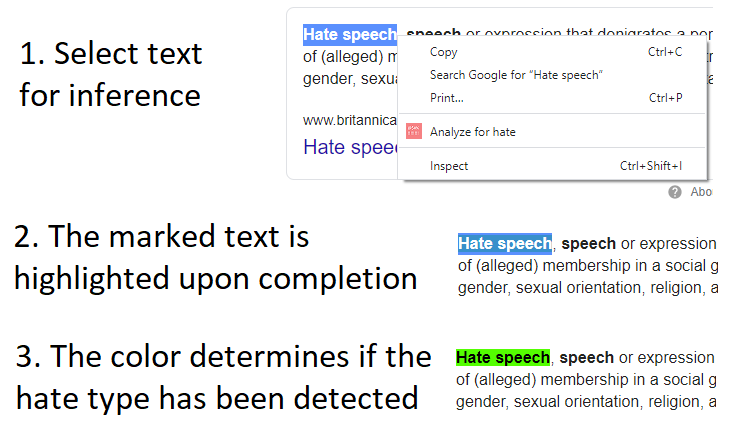
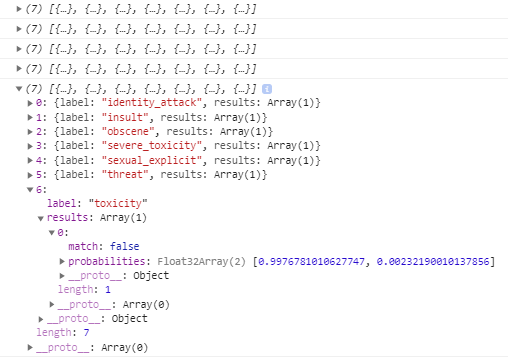

# hateblock

Do you want to find out if a text fragment you see on a website in your Chrome webbrowser is offensive in any way? This extension features a deep learning model running on your computer that can confirm or refute your gut feeling about a text being <i>(severely) toxic, a threat, sexually explicit, obscene, an insult or an identity attack</i>. That way, you can check if it is just your opinion or if the text is actually hateful.
Apart from that, the purpose of this app is to experiment with <b>Tensorflow.js</b> so that every user can see what an in-built deep learning model based on a <b>Universal Sentence Encoder</b> is capable of doing without needing to understand anything about AI. The classification works for <b>English</b> only and considers the <b>seven categories</b> mentioned above.

# How it works

Right-click on any text selection and choose "Analyze for hate". This will trigger the inference of the model, which is the [text toxicity detection example](https://github.com/tensorflow/tfjs-models/tree/master/toxicity) available for TensorFlow.js (their classifier demo website is available [here](https://storage.googleapis.com/tfjs-models/demos/toxicity/index.html)).
After the inference finishes (might take up to a few seconds), the text is highlighted with a color, depending on whether the hate type or the lack thereof has been detected or the result has been inconclusive.
<b>Hover over the marked text</b> to find out which of the seven categories have been detected, one of which is used for the purpose of color highlighting.
The user can <b>customize</b> which of the seven criteria the model should use for analysis in the popup menu of the addon. Just click on the icon of the extension, choose the desired option from the dropdown menu and save your changes using the save button. This is where one can also customize the three colors used for highlighting.

# Future work

What is not addressed is cosmetic issues like what happens if you change your selected text before the inference has finished or that the font for the marked text / missing whitespace after it might not be fitting within the other text. Feel free to create a fork of this repository to fix this if you care as the cost-benefit relationship is not worth it regarding my time. A more interesting aspect for the further development of this app might be to allow the user to use a different TensorFlow.js model for inference. 

# Related work

Previous work used an approach based on filter lists like the [Hate Filter by Fram](https://chrome.google.com/webstore/detail/hate-filter-by-fram/njcigjppohkjhjkdejnehfbdpepkalcf). Other software like [FakerFact](https://chrome.google.com/webstore/detail/fakerfact-fake-news-detec/hmcmekfmgfmilmmnicpmkfkccgnfegef) uses a REST API call for server-side machine learning inference.
My initial idea was to develop an add-on that analyzes all text on a website, not displaying hateful content to the user in the first place, but while this method [works for text replacement](https://9to5google.com/2015/06/14/how-to-make-a-chrome-extensions/), it is too time and resource consuming for model inference of every text fragment on a website within the context of hate classification as I have found out.
Perhaps one could use this approach for only certain DOM elements with relevant text fragments, using relevant DOM elements for different websites, e.g., DOM parts identifying tweet contents for Twitter and other parts for Facebook, but obviously, this approach would never cover all websites.
Therefore, the happy medium I chose was for the user to select the content to be analyzed manually, although this does not allow the text not to be seen by the user in the first place if it turns out to be offensive.
